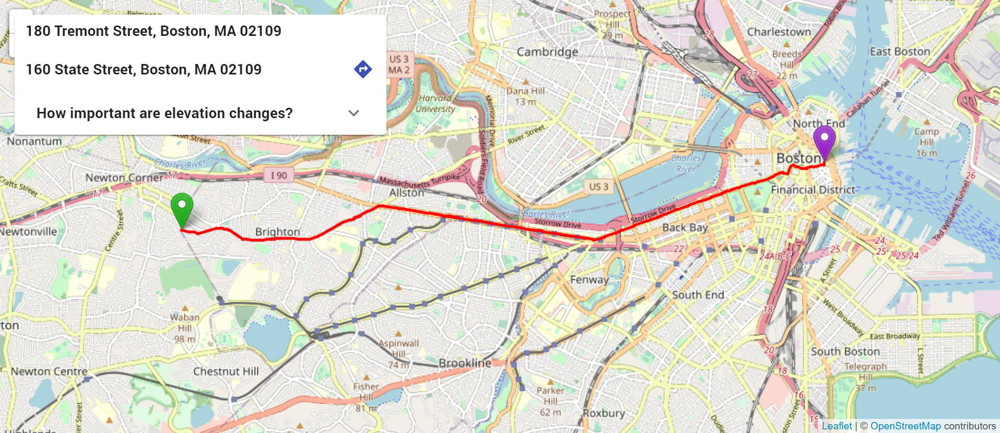

# EleNa: Elevation-based Navigation

Most traditional navigation apps aim to provide users with routes that prioritize shortest distance and/or time. However, for walkers and bikers, for whom elevation changes are important, this is not ideal. EleNa aims to remedy this by providing a route that prioritizes elevation changes at different user-selected intervals.

## Demo site

Our completed implementation can be found at http://elena-fear-and-loathing-in-520.s3-website-us-east-1.amazonaws.com/

- DO NOT send more than one request at a time. The EC2 instance this is running on takes a little while to process, and it doesn't have the ram/cpu to run multiple querries and as such will break if given more than one request at a time.

NOTE: Due to hosting costs, this site will only be hosted through May 2020.

## Running EleNa locally

### Front-end

The React-based front-end can be found in `elena1/`. From there, you can start the development server or build the production build yourself. See `elena1/README.md` for more information.

- NOTE: The front-end currently GETs the route data from our AWS server. You will need to change the URL in `Query/index.js` for the front-end to function properly.

### Back-end

The Python-based back-end can be found in `backend/`. After installing the dependencies, you can run `Server.py` to start the server. You can run tests by running `tests.py`.

## Limitations

- Due to server and OpenStreetMaps API limitations, the map can only rout southwestern Boston, Massachussetts (roughly between South Station and the Franklin Park Zoo) at this time.

- As mentioned above, the server can take up to 11 seconds to process a request. Sending multiple requests will crash the server.

## Authors

## Written for CS 520: Theory of Software Engineering (Spring 2020)

- **Alex Vukovic** - *Back-end, Testing, Meme Dealer* - [Alex Vukovic](https://github.com/AVukovic)

- **Anna Belander Schneider** - *Front-end, AWS Administration, Server Healer* - [Annabel Schneider](https://github.com/fire-and-yikes)

- **Coleander Smith** - *Do-It-All, Integration, Fearless Leader* - [Cole Smith](https://github.com/Th3OnlyN00b)

- **Will Hammond** - *Front-end, Documentation, Pun Weaver* - [Will Hammond](https://github.com/wkhammond)
